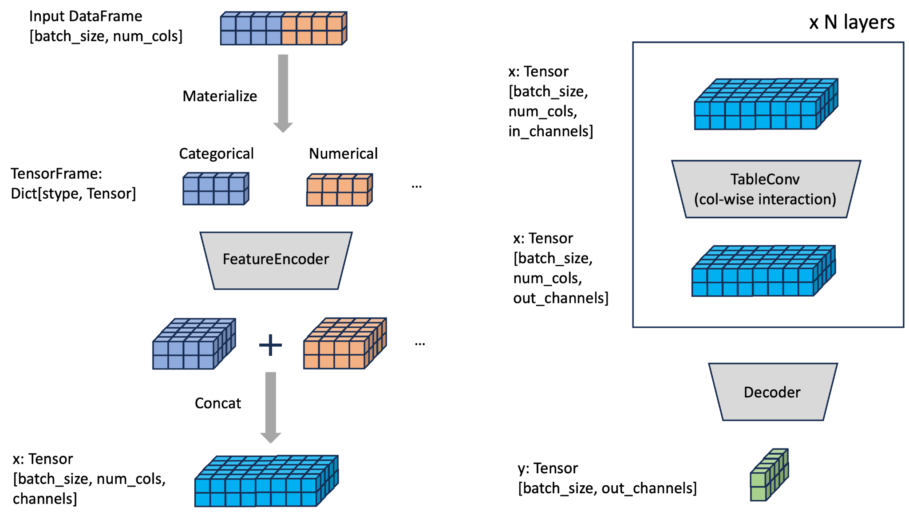

Modular Design of Deep Tabular Models
=====================================
Our key observation is that many tabular deep learning models all follow a modular design of :obj:`FeatureEncoder`, :obj:`TableConv`, and :obj:`Decoder`,
as shown in the figure below.

- First, the input :obj:`DataFrame` with different columns is converted to :class:`TensorFrame`, where the columns are organized according to their `stype` (semantic types).
- Then, the :class:`~torch_frame.TensorFrame` is fed into :class:`~torch_frame.nn.encoder.FeatureEncoder` which converts each `stype` feature into a 3-dimensional :obj:`Tensor`.
- The :obj:`Tensor`'s across different `stypes` are then concatenated into a single :obj:`Tensor` :obj:`x` of shape [`batch_size`, `num_cols`, `num_channels`].
- The :obj:`Tensor` :obj:`x` is then updated iteratively via :class:`TableConv`'s.
- The updated :obj:`Tensor` :obj:`x` is inputed into :class:`~torch_frame.nn.decoder.Decoder` to produce the output :obj:`Tensor` of shape [`batch_size`, `out_channels`].

:class:`FeatureEncoder`
--------------------------------------

:class:`~torch_frame.nn.encoder.FeatureEncoder` transforms input :class:`~torch_frame.TensorFrame` into 3-dimensional :obj:`Tensor` :obj:`x`.
This class can contain learnable parameters and `NaN` (missing value) handling.

:class:`~torch_frame.nn.encoder.StypeWiseFeatureEncoder` inherits from :class:`~torch_frame.nn.encoder.FeatureEncoder`.
It takes :class:`~torch_frame.TensorFrame` as input and applies stype-specific feature encoder (specified via :obj:`stype_encoder_dict`) to :obj:`Tensor` of each stype to get embeddings for each `stype`.
The embeddings of different `stypes` are then concatenated to give the final 3-dimensional :obj:`Tensor` :obj:`x` of shape :obj:`[batch_size, num_cols, channels]`.

Below is an example usage of :class:`~torch_frame.nn.encoder.StypeWiseFeatureEncoder`.
It uses :class:`~torch_frame.nn.encoder.EmbeddingEncoder` for encoding `stype.categorical` columns and :class:`~torch_frame.nn.encoder.LinearEncoder` for encoding `stype.numerical` columns.

.. code-block:: python

    from torch import LayerNorm
    from torch_frame import stype
    from torch_frame.nn import (
        EmbeddingEncoder,
        LinearBucketEncoder,
    )

    stype_encoder_dict = {
        stype.categorical:
        EmbeddingEncoder(),
        stype.numerical:
        LinearBucketEncoder(),
    }

    encoder = StypeWiseFeatureEncoder(
        out_channels=channels,
        col_stats=col_stats,
        col_names_dict=col_names_dict,
        stype_encoder_dict=stype_encoder_dict,
    )

There are other encoders implemnted as well such as :class:`~torch_frame.nn.encoder.LinearBucketEncoder` and :class:`~torch_frame.nn.encoder.ExcelFormerEncoder` for `stype.numerical` columns, and
:class:`~torch_frame.nn.encoder.LinearEmbeddingEncoder` for `stype.text_embedded` columns.
You can also implement your custom encoder for given `stype` by inheriting :class:`~torch_frame.nn.encoder.StypeEncoder`.

:class:`TableConv`
-----------------------------------

The table convolution layer inherits from :class:`~torch_frame.nn.conv.TableConv`.
It takes the 3-dimensional :obj:`Tensor` :obj:`x` of shape :obj:`[batch_size, num_cols, channels]` as input and
updates the column embeddings based on embeddings of other columns; thereby modeling the complex interactions among different column values.
Below, we show a simple self-attention-based table convolution to modle the interaction among columns.

.. code-block:: python

    import torch
    import torch.nn.functional as F
    from torch import Tensor
    from torch.nn import Linear
    from torch_frame.nn import TableConv

    class SelfAttentionConv(TableConv):
      def __init__(self, channels: int):
          super().__init__()
          self.channels = channels
          # Linear functions for modeling key/query/value in self-attention.
          self.lin_k = Linear(channels, channels)
          self.lin_q = Linear(channels, channels)
          self.lin_v = Linear(channels, channels)

      def forward(self, x: Tensor) -> Tensor:
          # [batch_size, num_cols, channels]
          x_key = self.lin_k(x)
          x_query = self.lin_q(x)
          x_value = self.lin_v(x)
          prod = x_query.bmm(x_key.transpose(2, 1)) / math.sqrt(self.channels)
          # Attention weights between all pairs of columns.
          attn = F.softmax(prod, dim=-1)
          # Mix `x_value` based on the attention weights
          out = attn.bmm(x_value)
          return out

Initializing and calling it is straightforward.

.. code-block:: python

    conv = SelfAttentionConv(32)
    x = conv(x)

:class:`Decoder`
-------

:class:`~torch_frame.nn.decoder.Decoder`. transforms the input :class:`Tensor` :obj:`x` into output :class:`Tensor` `out` of shape :obj:`[batch_size, out_channels]`, representing
the row embeddings of the original :obj:`DataFrame`.

Below is a simple example of `Decoder` that mean-pools over the column embeddings, followed by a linear transformation.

.. code-block:: python

    import torch
    from torch import Tensor
    from torch.nn import Linear
    from torch_frame.nn import Decoder

    class MeanDecoder(Decoder):
        def __init__(self, in_channels: int, out_channels: int):
            super().__init__()
            self.lin = torch.nn.Linear(in_channels, out_channels)

        def forward(self, x: Tensor) -> Tensor:
            # Mean pooling over the column dimension
            # [batch_size, num_cols, in_channels] -> [batch_size, in_channels]
            out = torch.mean(x, dim=1)
            # [batch_size, out_channels]
            return self.lin(out)
