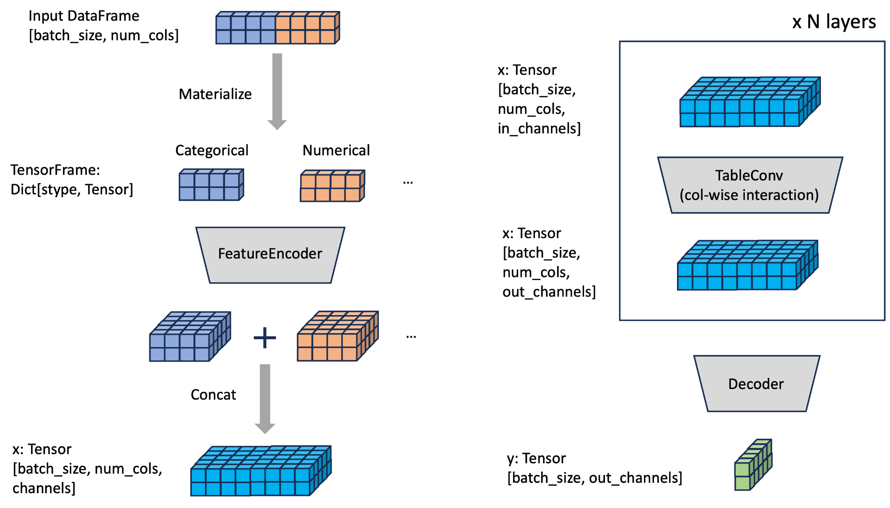

Modular Design of Deep Tabular Models
=====================================

Many recent strong tabular deep models follow modular design (Encoder, Table convolution, Decoder). We design the overall architecture of deep tabular models in :pyg:`PyTorch Frame` in the following image.

Encoder
-------
Feature encoder encodes the categorical and numerical features.

Implementation of Convolution Layer
-----------------------------------

The TableConv
